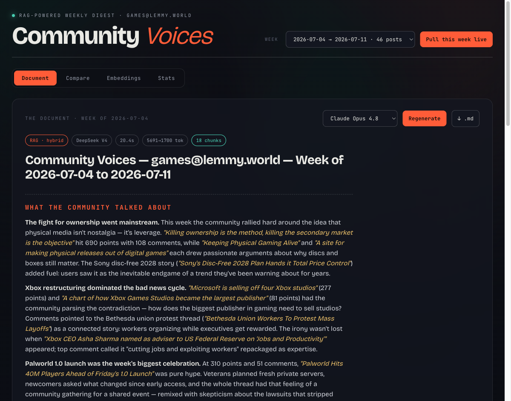
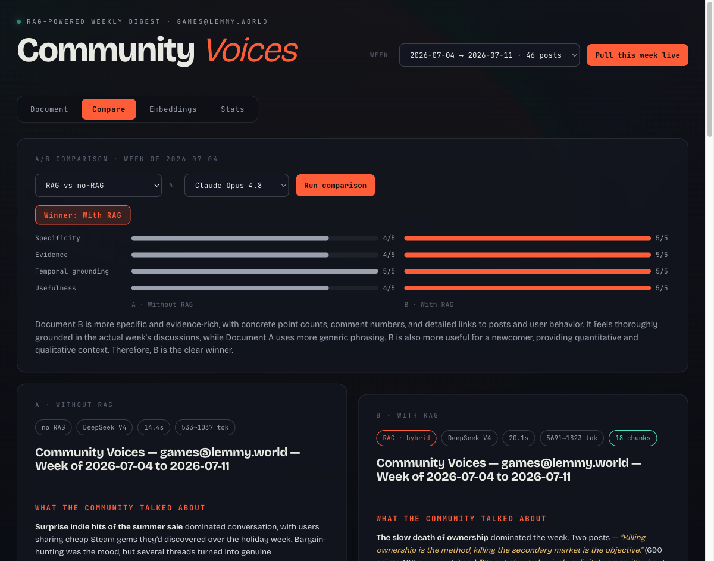

# Community Voices

A full-stack RAG application that listens to a gaming community and writes a weekly
**Community Voices Document**: what the community talked about, the standout
threads, how last week's predictions held up, and what it will talk about next
week — grounded in the community's actual posts via retrieval-augmented
generation, with built-in A/B testing of the whole idea.

The community is **c/games on lemmy.world** — the fediverse's largest gaming
community — chosen deliberately: its API is public by design, so evaluators can
run the crawler and the live week-pull with **zero credentials**. (The app was
originally built against r/gaming; Reddit's 2026 Data API approval gate — manual
review, weeks-long waits, unauthenticated `.json`/RSS both blocked — made
evaluator-reproducible ingestion impossible. The Reddit OAuth crawler remains in
the repo: `python -m app.ingest gaming --source reddit`.)

Built for the Community Voices engineering challenge (see
[objective.md](objective.md); progress log in [ROADMAP.md](ROADMAP.md)).





## Quick start

Requirements: **Python 3.11+**. Node is *not* required — the frontend ships
pre-built.

```bash
git clone https://github.com/BryanZaneee/community-voices.git
cd community-voices/backend
python3 -m venv .venv && .venv/bin/pip install -r requirements.txt
.venv/bin/uvicorn app.main:app --port 8000
# open http://localhost:8000
```

The repo ships with a pre-ingested database (`data/community.sqlite`) holding a
month of c/games activity (200 posts, 455 embedded chunks, 5 week windows) plus
pre-generated weekly documents and one judged comparison of each kind, so the
app demos **with zero API keys**. Add keys to unlock more:

| You have | You can |
|---|---|
| no keys | Browse every week's documents, all stored comparisons, the embedding map, and retrieval stats |
| `ANTHROPIC_API_KEY` or `DEEPSEEK_API_KEY` | Generate new documents and run comparisons (retrieval falls back to BM25 keyword search without a Voyage key) |
| + `VOYAGE_API_KEY` | Full hybrid retrieval (BM25 + vector, RRF-fused) |
| + `VOYAGE_API_KEY` (same key) | "Pull this week live" — ingest the trailing 7 days of c/games on demand, no other credentials |
| `REDDIT_CLIENT_ID` / `REDDIT_CLIENT_SECRET` | Only for `--source reddit` — requires Reddit's Data API approval (2026 policy) |

Copy `.env.example` to `.env` in the repo root and fill in what you have.

## What's inside

```
Lemmy c/games (top posts + comments)   FastAPI                    React SPA
        │  crawler (open API,           │                          │
        │  parallel fetches;            │  /api/generate           │  Document tab
        │  --source reddit kept)        │  /api/compare            │  Compare tab
        ▼                               │                          │  Embeddings tab
  markdown per post ── chunker ──► sqlite-vec vector table         │  Stats tab
                          │        + BM25 (in-memory)              │
                          ▼             │                          │
                    Voyage embeddings   └── retrieval stats, PCA ──┘
```

- **Vector store**: a `vec0` virtual table (sqlite-vec) living in the same
  SQLite file as the relational tables (posts, documents, comparisons,
  retrieval stats) — "a vectorized database table in a relational database,"
  verbatim. Chosen deliberately: cloning the repo *is* getting the data, and
  the schema ports 1:1 to Postgres + pgvector if this were multi-writer
  production.
- **Retrieval**: 6 canonical facet queries ("debates and controversies",
  "questions people are asking", …) run against the selected week's chunks.
  Hybrid mode fuses BM25 and vector KNN with Reciprocal Rank Fusion; every
  retrieved chunk bumps a retrieval counter (the Stats tab leaderboard and the
  dot sizes on the embedding map).
- **Generation**: 4 models via one registry — Claude Opus 4.8, Claude Haiku
  4.5, DeepSeek V4, DeepSeek V4 Flash — each generation records latency and
  token usage.
- **Judging**: every comparison is scored on specificity, evidence, temporal
  grounding, and usefulness — Claude Haiku structured outputs when an Anthropic
  key works, automatic fallback to DeepSeek V4 JSON mode otherwise.

## The A/B tests (three kinds)

1. **RAG vs no-RAG** — the same model writes the document with retrieved
   context vs from parametric knowledge alone. This is the challenge's core
   question: without RAG the model can only produce plausible generalities;
   with RAG it cites real threads with real scores.
2. **Model vs model** — same week, same retrieved context, two different
   models; judge scores plus hard latency/token/cost numbers.
3. **Retrieval vs retrieval** — hybrid vs vector-only vs BM25-only, with the
   Jaccard overlap of retrieved chunk sets. Quantifies what the embeddings buy
   over plain keyword search.

## The crawler

`python -m app.ingest games` (from `backend/`, with `VOYAGE_API_KEY` in
`.env` — nothing else needed):

1. **Listing sweep** — paginated requests to Lemmy's open
   `/api/v3/post/list?community_name=games&sort=TopMonth` → ~200 posts.
   (`--source reddit` swaps in the OAuth `top.json` sweep instead.)
2. **Comment fetches** — top ~30 posts per trailing 7-day window with ≥5
   comments, fetched in parallel (6 workers), top-level comments only.
3. **Chunk → embed → index** — each post becomes a small markdown doc
   (title, metadata, selftext, top comments), split into ~400-token chunks
   with stable content-hash IDs, embedded in batches of 64, upserted into
   sqlite-vec, then the 2-D PCA projection is recomputed.

Handling "overly large amounts of data": ~200-post cap per month, comment
fetches only where there's real discussion, 12 comments/post, per-field
truncation — a month lands around 600–1200 chunks. Re-runs are idempotent:
stable chunk IDs mean overlapping windows only embed what's new. The in-app
**"Pull this week live"** button runs the same pipeline for the trailing 7 days
(~15 s) and the new window appears in the week selector. Measured on the real
month ingest: 200 posts + 119 comment fetches in 6.2 s, chunk + embed + index
in 12.4 s.

## Performance notes

Measured by `backend/tests/test_rag_roundtrip.py` (no API keys needed):

- 640 chunks: build + hash-embed + index in ~150 ms
- hybrid search: **0.8 ms** (BM25 0.5 ms, vector KNN 0.2 ms)

Ported-code review: BM25 precomputes per-document token counters at index time
(the original re-tokenized every doc on every query); vector upserts run in a
single transaction; KNN uses sqlite-vec's native `MATCH ... k = ?` path.

## Tests

```bash
cd backend && .venv/bin/python -m pytest tests -s
```

Covers the chunk → embed → index → retrieve round trip, week-window filtering,
the keyless BM25 fallback, and stable chunk IDs, and prints the perf timings
above.

## Requirements coverage

| objective.md | Where |
|---|---|
| 1. Community with an active online presence | c/games@lemmy.world (CLI-configurable; reddit source kept) |
| 2. App generating a Community Voices Document (past week + predictions) | Document tab; markdown download |
| 3. RAG-empowered generation | week-scoped facet retrieval → context-grounded prompt |
| 3a. Vector DB / vectorized table in a relational DB | sqlite-vec `vec0` table inside SQLite |
| 3b. Flattened embedding visualization | Embeddings tab — PCA scatter |
| 3c. Stats on most-retrieved embeddings | retrieval counters, Stats leaderboard, dot sizing |
| 4. Automated vector-store fill | `app/ingest.py` crawler + live-pull endpoint |
| 4a. Crawlers / agentic ingestion | OAuth Reddit crawler, parallel fetches |
| 4b. Overly-large-data handling | caps, thresholds, truncation (see The crawler) |
| 5. A/B test with vs without RAG | Compare tab, judge scorecard, stored runs |

Beyond the brief: a month of history with per-week documents, a
prediction-vs-reality review section, 4-model comparison with cost/latency
stats, retrieval-mode comparison with chunk overlap, hybrid RRF retrieval,
LLM-judge scoring, zero-key read-only demo mode, and a live-scrape button.
