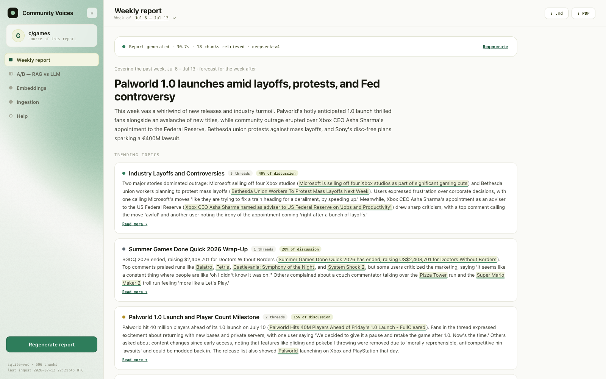

# Community Voices

[](https://github.com/BryanZaneee/community-voices/actions/workflows/tests.yml)

A full-stack RAG application that listens to a gaming community and writes a
weekly **Community Voices Document**: what the community talked about, the
standout threads, and what it will talk about next week. Every claim is
grounded in the community's actual posts via retrieval-augmented generation,
with built-in A/B testing of the whole idea.

The community is **c/games on lemmy.world**, the fediverse's largest gaming
community, chosen deliberately: its API is public by design, so anyone can
run the crawler and the live week-pull with **zero credentials**. (I would
have used Reddit, but scraping it now requires an approved developer account.
Reddit's 2026 Data API gate blocks unauthenticated `.json`/RSS access, so
nobody cloning this repo could reproduce the ingest.)



## Quick start

Requirements: **Python 3.11+**. Node is *not* required; the frontend ships
pre-built.

```bash
git clone https://github.com/BryanZaneee/community-voices.git
cd community-voices/backend
python3 -m venv .venv && .venv/bin/pip install -r requirements.txt
.venv/bin/uvicorn app.main:app --port 8000
# open http://localhost:8000
```

The repo ships with a pre-ingested corpus (`data/community.sqlite`): a month
of c/games activity as ~250 posts, 506 chunks with real voyage-3-large
embeddings, and 5 week windows. Nothing is pre-generated. Every document and
A/B comparison you see is produced live when you click the button, so you
watch the RAG pipeline do its work rather than browse canned output.

Generation needs two free API keys (DeepSeek: platform.deepseek.com, Voyage:
dashboard.voyageai.com). Copy `.env.example` to `.env` in the repo root and
fill in:

| Key | What it unlocks |
|---|---|
| `DEEPSEEK_API_KEY` | Generate weekly documents and run A/B comparisons (retrieval falls back to BM25 keyword search without a Voyage key) |
| `VOYAGE_API_KEY` | Full hybrid retrieval (BM25 + vector, RRF-fused) and the "Run now" live pull, which ingests the trailing 7 days of c/games on demand |

Without keys the app still boots: you can browse the embedding map, the
ingested corpus, and the ingestion funnel, and the full test suite runs.

## Using the app

- **Weekly report**: pick a week, click **Generate report**, and watch the
  eight-stage pipeline run live. Download the finished document as `.md` or
  print to PDF.
- **A/B (RAG vs LLM)**: every generation also writes the no-retrieval
  baseline and judges both blind; this tab shows the side-by-side documents,
  scorecard, and verdict.
- **Embeddings**: the 2-D map of every chunk. Toggle topic clusters vs
  retrieval heat, and click a cluster to inspect its most-retrieved chunks.
- **Ingestion**: the crawl funnel and latest-run numbers. **Run now** pulls
  the trailing 7 days of c/games live (needs a Voyage key).
- **Help**: a plain-English FAQ of the moving parts.

## What's inside

```
Lemmy c/games (top posts + comments)   FastAPI                    React SPA
        │  crawler (open API,           │                          │
        │  parallel fetches)            │  /api/generate(/stream)  │  Report tab
        │                               │  /api/compare            │  Embeddings tab
        ▼                               │                          │  A/B tab
  markdown per post ── chunker ──► sqlite-vec vector table         │  Ingestion tab
                          │        + BM25 (in-memory)              │  Help tab
                          ▼             │                          │
                    Voyage embeddings   └── retrieval stats,       │
                                            UMAP/PCA + clusters ───┘
```

- **Vector store**: a `vec0` virtual table (sqlite-vec) living in the same
  SQLite file as the relational tables (posts, documents, comparisons,
  retrieval stats). That is "a vectorized database table in a relational
  database," verbatim. Chosen deliberately: cloning the repo *is* getting the
  data, and the schema ports 1:1 to Postgres + pgvector if this were
  multi-writer production.
- **Retrieval**: 6 canonical facet queries ("debates and controversies",
  "questions people are asking", …) run against the selected week's chunks.
  Hybrid mode fuses BM25 and vector KNN with Reciprocal Rank Fusion; every
  retrieved chunk bumps a retrieval counter (the Embeddings tab leaderboard
  and the dot sizes on the embedding map).
- **Generation**: DeepSeek V4; each generation records latency, token usage,
  and estimated cost. The model emits a structured JSON report
  (headline, topics with discussion share and expandable detail, standout
  threads, confidence-scored predictions); the exported markdown is built from
  it server-side. `GET /api/generate/stream` is the SSE variant that drives
  the UI's live eight-stage pipeline animation.
- **Embedding map**: the stored 2-D projection uses UMAP when `umap-learn` is
  installed (the committed DB ships UMAP coords) and falls back to plain PCA
  otherwise; k-means clusters with TF-IDF term labels color the map.
  Recompute anytime without re-embedding: `.venv/bin/python -m app.rag.pca`.
- **Judging**: every comparison is scored blind on specificity, evidence,
  temporal grounding, and usefulness via DeepSeek JSON mode. The judge is
  also handed the RAG run's actual retrieved chunks as `<source_material>`
  ground truth: claims the week's real posts don't support are scored as
  fabrications, so confident invention can't win on specificity. It is never
  told which document had access to that material.

## Report Flow

What happens between clicking **Generate** and reading the report:

1. **Click**: the Report tab kicks off the fullscreen generation
   animation and opens a Server-Sent Events connection to
   `GET /api/generate/stream` with the selected week and model.
2. **Cached stages replay**: crawl, reduce, and embed already ran at
   ingest time, so the backend instantly emits those three stages with
   their real numbers from the database (posts crawled, chunks produced,
   embedding model) rather than pretending to redo them.
3. **Retrieve**: a worker thread runs retrieval. Six fixed facet queries
   ("debates and controversies," "tips and recommendations," …) are each
   searched against *only that week's* chunks using hybrid retrieval,
   BM25 keyword search plus sqlite-vec vector search, fused with
   reciprocal-rank fusion (BM25-only if no Voyage key). Results are
   deduped keeping each chunk's best score, and the top 18 chunks become
   the context.
4. **Write**: the chunks, with their posts' titles, scores, and dates,
   are formatted into a context block and sent to the LLM with a JSON
   schema describing the report (headline, lede, 3-5 topics,
   predictions). Stage events stream back with latency and token counts.
5. **Store**: the model's JSON is rendered to markdown and saved to the
   `documents` table along with everything needed to audit the run:
   the queries, retrieved chunk ids, retrieval mode, latency, and token
   counts. If the model ignored the schema, its raw text is kept and
   rendered as plain markdown.
6. **Predict / A/B**: a `predict` stage reports the forecasts parsed from
   the stored report, then the same model writes the no-retrieval baseline
   document (`ab` stage) for the comparison.
7. **Done, then judged**: as soon as both drafts exist the stream emits
   `done` with the RAG document and the report fades in, while the blind
   LLM judge keeps deliberating in the background, grading both drafts
   against the RAG run's retrieved chunks as ground truth. The verdict
   arrives as a final `comparison` event that refreshes the A/B tab
   (which says "Judge still deciding…" until then). The frontend paces
   the progress bar smoothly (SSE events set the stage floor; a ticker
   eases toward each stage's ceiling, and the two LLM-call stages
   dominate real wall-clock). If generation fails, an `error` event
   surfaces the message and the previously stored report stays on screen.

## The A/B test

**RAG vs no-RAG**: the same model writes the document with retrieved context
vs from parametric knowledge alone. This is the core question RAG is supposed
to answer: without it the model can only produce plausible generalities; with
it, it cites real threads with real scores. The A/B tab shows it four ways:
side-by-side documents with grounded claims highlighted and hedged ones
dashed, a claim-composition bar per document, a blind 1-5 rubric scored by an
LLM judge that grades both documents against the RAG run's retrieved source
material (so made-up specifics count against a document, not for it), and
paired run metrics (cost, latency, tokens, verifiable citations) that end in
an honest pros-and-cons verdict. RAG costs more and runs slower, and it is
the only version that says anything true about the week.

## The crawler

`.venv/bin/python -m app.ingest games` (from `backend/`, with `VOYAGE_API_KEY`
in `.env`; nothing else needed):

1. **Listing sweep**: paginated requests to Lemmy's open
   `/api/v3/post/list?community_name=games&sort=TopMonth` → ~200 posts.
2. **Comment fetches**: top ~30 posts per trailing 7-day window with ≥5
   comments, fetched in parallel (6 workers), top-level comments only.
3. **Chunk → embed → index**: each post becomes a small markdown doc
   (title, metadata, selftext, top comments), split into ~400-token chunks
   with stable content-hash IDs, embedded in batches of 64, upserted into
   sqlite-vec, then the 2-D projection (UMAP, PCA fallback) and topic
   clusters are recomputed. The run's funnel numbers persist to the meta
   table and feed the Ingestion tab.

Handling "overly large amounts of data": ~200-post cap per month, comment
fetches only where there's real discussion, 12 comments/post, and per-field
truncation. A month lands in the mid-hundreds of chunks (this repo's committed
month: 506). Re-runs are idempotent: stable chunk IDs mean overlapping windows
only embed what's new. The Ingestion tab's **"Run now"** button runs the same
pipeline for the trailing 7 days (~15 s) and the new window appears in the
week selector. Measured on the real month ingest: 200 posts + 119 comment
fetches in 6.2 s, chunk + embed + index in 12.4 s.

Because re-runs are idempotent, unattended weekly ingestion is one cron line:

```cron
0 6 * * 1  cd /path/to/community-voices/backend && .venv/bin/python -m app.ingest games --window week
```

## Performance notes

Measured on a 200-post / ~640-chunk synthetic corpus (no API keys needed):

- 640 chunks: build + hash-embed + index in ~150 ms
- hybrid search: **0.8 ms** (BM25 0.5 ms, vector KNN 0.2 ms)

Ported-code review: BM25 precomputes per-document token counters at index time
(the original re-tokenized every doc on every query); vector upserts run in a
single transaction; KNN uses sqlite-vec's native `MATCH ... k = ?` path.

## Development

The served frontend is a pre-built SPA (`frontend/dist/`, committed on
purpose so evaluators skip Node). To hack on it:

```bash
cd backend && .venv/bin/uvicorn app.main:app --reload   # API on :8000
cd frontend && npm install && npm run dev               # Vite dev server, proxies /api to :8000
cd frontend && npm run build                            # refresh frontend/dist before committing
```

## Tests

```bash
cd backend && .venv/bin/python -m pytest tests -q   # no API keys needed
```

Four layers, run in CI on every push:

- **Unit**: one file per module, fully offline (embeddings faked, LLM calls
  stubbed): chunker (splits, overlap, stable IDs), BM25 (ranking, distance
  transform), vector index (KNN, upserts, dim guards), embeddings, retriever
  (exact RRF math, mode switches, keyless degradation, week filtering), PCA,
  db helpers, ingest (markdown mapping, Lemmy field mapping, idempotency),
  llm (cost math, judge fallback chain), generation (facet retrieval,
  prompts, persistence).
- **API**: every endpoint through FastAPI's TestClient: happy paths, 400/404
  paths, download headers, stats accumulation, the SSE stream's event order,
  the SPA mount, plus the product story end-to-end with every retrieval
  counted exactly once.
- **Real data**: integration tests over the committed store itself, real
  crawled posts and real voyage-3-large vectors, still keyless. Stored
  embeddings double as query vectors, so the suite proves KNN self-retrieval
  (each chunk's own vector finds it at distance ~0), vector-mode and
  week-filtered retrieval, and BM25 ranking against the actual corpus. One
  extra test embeds a live query through the Voyage API when
  `VOYAGE_API_KEY` is present (skipped in CI).
- **Regression**: pins bugs fixed during development (week-boundary
  alignment) plus a golden chunk-ID snapshot protecting the committed vector
  store.

## Features

| Feature | Where |
|---|---|
| Active community source (c/games@lemmy.world, CLI-configurable) | `app/ingest.py` |
| Weekly Community Voices Document (past week + predictions) | Report tab; `.md` download + print-to-PDF |
| RAG-empowered generation | week-scoped facet retrieval → context-grounded prompt, live SSE pipeline |
| Vectorized table in a relational DB | sqlite-vec `vec0` table inside SQLite |
| Flattened embedding visualization | Embeddings tab: UMAP scatter, topic clusters, retrieval-heat mode |
| Stats on most-retrieved embeddings | retrieval counters, most-retrieved table, cluster inspector, dot sizing |
| Automated vector-store fill | Ingestion tab + `app/ingest.py` crawler + live-pull endpoint + weekly cron one-liner |
| Crawler / agentic ingestion | open Lemmy API crawler, parallel fetches |
| Overly-large-data handling | caps, thresholds, truncation (see The crawler; funnel on the Ingestion tab) |
| A/B testing, with and without RAG | A/B tab: citation highlighting, judge scorecard, run metrics |

Also included: a month of ingested history across five week windows, hybrid
RRF retrieval, blind LLM-judge scoring, and a live-scrape button.
