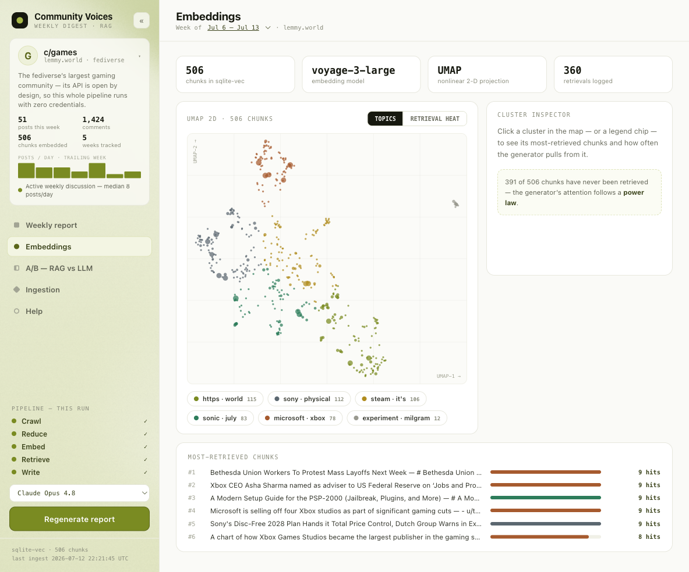
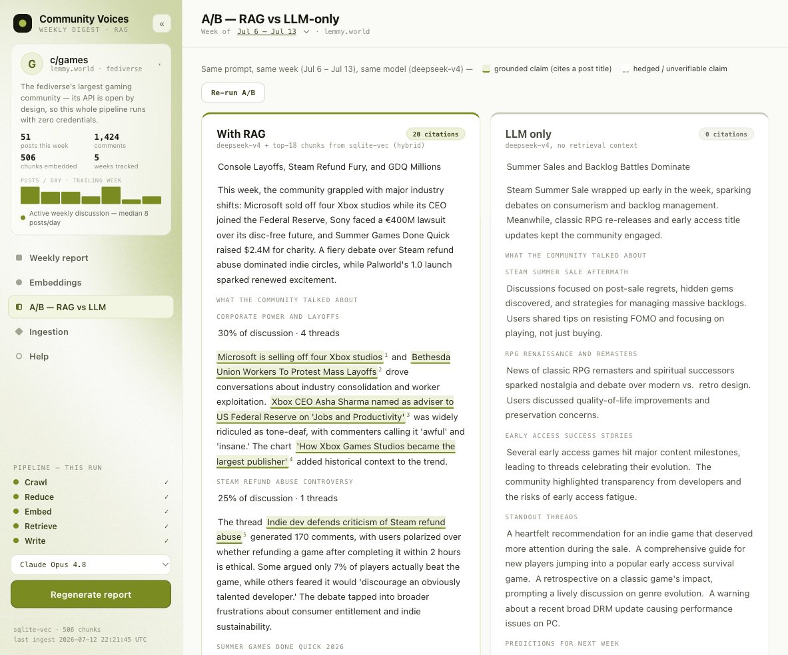

# Community Voices

[](https://github.com/BryanZaneee/community-voices/actions/workflows/tests.yml)

A full-stack RAG application that listens to a gaming community and writes a weekly
**Community Voices Document**: what the community talked about, the standout
threads, how last week's predictions held up, and what it will talk about next
week — grounded in the community's actual posts via retrieval-augmented
generation, with built-in A/B testing of the whole idea.

The community is **c/games on lemmy.world** — the fediverse's largest gaming
community — chosen deliberately: its API is public by design, so anyone can
run the crawler and the live week-pull with **zero credentials**. (The app was
originally built against r/gaming; Reddit's 2026 Data API approval gate — manual
review, weeks-long waits, unauthenticated `.json`/RSS both blocked — made
reproducible ingestion impossible for other people trying the project. The
Reddit OAuth crawler remains in the repo:
`.venv/bin/python -m app.ingest gaming --source reddit`.)





## Quick start

Requirements: **Python 3.11+**. Node is *not* required — the frontend ships
pre-built.

```bash
git clone https://github.com/BryanZaneee/community-voices.git
cd community-voices/backend
python3 -m venv .venv && .venv/bin/pip install -r requirements.txt
.venv/bin/uvicorn app.main:app --port 8000
# open http://localhost:8000
```

The repo ships with a pre-ingested database (`data/community.sqlite`) holding a
month of c/games activity (~250 posts, 506 embedded chunks, 5 week windows)
plus pre-generated weekly documents and a judged RAG-vs-baseline comparison,
so the app demos **with zero API keys**. Add keys to unlock more:

| You have | You can |
|---|---|
| no keys | Browse every week's documents, all stored comparisons, the embedding map, and retrieval stats |
| `ANTHROPIC_API_KEY` or `DEEPSEEK_API_KEY` | Generate new documents and run comparisons (retrieval falls back to BM25 keyword search without a Voyage key) |
| + `VOYAGE_API_KEY` | Full hybrid retrieval (BM25 + vector, RRF-fused) |
| + `VOYAGE_API_KEY` (same key) | "Pull this week live" — ingest the trailing 7 days of c/games on demand, no other credentials |
| `REDDIT_CLIENT_ID` / `REDDIT_CLIENT_SECRET` | Only for `--source reddit` — requires Reddit's Data API approval (2026 policy) |

Copy `.env.example` to `.env` in the repo root and fill in what you have.

## What's inside

```
Lemmy c/games (top posts + comments)   FastAPI                    React SPA
        │  crawler (open API,           │                          │
        │  parallel fetches;            │  /api/generate(/stream)  │  Report tab
        │  --source reddit kept)        │  /api/compare            │  Embeddings tab
        ▼                               │                          │  A/B tab
  markdown per post ── chunker ──► sqlite-vec vector table         │  Ingestion tab
                          │        + BM25 (in-memory)              │  Help tab
                          ▼             │                          │
                    Voyage embeddings   └── retrieval stats,       │
                                            UMAP/PCA + clusters ───┘
```

- **Vector store**: a `vec0` virtual table (sqlite-vec) living in the same
  SQLite file as the relational tables (posts, documents, comparisons,
  retrieval stats) — "a vectorized database table in a relational database,"
  verbatim. Chosen deliberately: cloning the repo *is* getting the data, and
  the schema ports 1:1 to Postgres + pgvector if this were multi-writer
  production.
- **Retrieval**: 6 canonical facet queries ("debates and controversies",
  "questions people are asking", …) run against the selected week's chunks.
  Hybrid mode fuses BM25 and vector KNN with Reciprocal Rank Fusion; every
  retrieved chunk bumps a retrieval counter (the Stats tab leaderboard and the
  dot sizes on the embedding map).
- **Generation**: 4 models via one registry — Claude Opus 4.8, Claude Haiku
  4.5, DeepSeek V4, DeepSeek V4 Flash — each generation records latency, token
  usage, and estimated cost. The model emits a structured JSON report
  (headline, topics with discussion share, standout threads, prediction
  review, confidence-scored predictions); the exported markdown is built from
  it server-side. `GET /api/generate/stream` is the SSE variant that drives
  the UI's live five-stage pipeline animation.
- **Embedding map**: the stored 2-D projection uses UMAP when `umap-learn` is
  installed (the committed DB ships UMAP coords) and falls back to plain PCA
  otherwise; k-means clusters with TF-IDF term labels color the map.
  Recompute anytime without re-embedding: `.venv/bin/python -m app.rag.pca`.
- **Judging**: every comparison is scored on specificity, evidence, temporal
  grounding, and usefulness — Claude Haiku structured outputs when an Anthropic
  key works, automatic fallback to DeepSeek V4 JSON mode otherwise.

## The A/B tests (three kinds)

1. **RAG vs no-RAG** — the same model writes the document with retrieved
   context vs from parametric knowledge alone. This is the core question RAG
   is supposed to answer: without it the model can only produce plausible
   generalities; with it, it cites real threads with real scores. This is the
   comparison the A/B tab renders, with grounded claims highlighted and
   hedged/unverifiable ones dashed.
2. **Model vs model** — same week, same retrieved context, two different
   models; judge scores plus hard latency/token/cost numbers.
3. **Retrieval vs retrieval** — hybrid vs vector-only vs BM25-only, with the
   Jaccard overlap of retrieved chunk sets. Quantifies what the embeddings buy
   over plain keyword search.

Kinds 2 and 3 run via `POST /api/compare` (the UI surfaces kind 1); all
stored comparisons remain queryable at `GET /api/comparisons/latest?kind=`.

## The crawler

`.venv/bin/python -m app.ingest games` (from `backend/`, with `VOYAGE_API_KEY`
in `.env` — nothing else needed):

1. **Listing sweep** — paginated requests to Lemmy's open
   `/api/v3/post/list?community_name=games&sort=TopMonth` → ~200 posts.
   (`--source reddit` swaps in the OAuth `top.json` sweep instead.)
2. **Comment fetches** — top ~30 posts per trailing 7-day window with ≥5
   comments, fetched in parallel (6 workers), top-level comments only.
3. **Chunk → embed → index** — each post becomes a small markdown doc
   (title, metadata, selftext, top comments), split into ~400-token chunks
   with stable content-hash IDs, embedded in batches of 64, upserted into
   sqlite-vec, then the 2-D projection (UMAP, PCA fallback) and topic
   clusters are recomputed. The run's funnel numbers persist to the meta
   table and feed the Ingestion tab.

Handling "overly large amounts of data": ~200-post cap per month, comment
fetches only where there's real discussion, 12 comments/post, per-field
truncation — a month lands in the mid-hundreds of chunks (this repo's committed
month: 506). Re-runs are idempotent: stable chunk IDs mean overlapping windows
only embed what's new. The Ingestion tab's **"Run now"** button runs the same
pipeline for the trailing 7 days (~15 s) and the new window appears in the
week selector. Measured on the real month ingest: 200 posts + 119 comment
fetches in 6.2 s, chunk + embed + index in 12.4 s.

Because re-runs are idempotent, unattended weekly ingestion is one cron line:

```cron
0 6 * * 1  cd /path/to/community-voices/backend && .venv/bin/python -m app.ingest games --window week
```

## Performance notes

Measured on a 200-post / ~640-chunk synthetic corpus (no API keys needed):

- 640 chunks: build + hash-embed + index in ~150 ms
- hybrid search: **0.8 ms** (BM25 0.5 ms, vector KNN 0.2 ms)

Ported-code review: BM25 precomputes per-document token counters at index time
(the original re-tokenized every doc on every query); vector upserts run in a
single transaction; KNN uses sqlite-vec's native `MATCH ... k = ?` path.

## Tests

```bash
cd backend && .venv/bin/python -m pytest tests -q   # 78 tests, no API keys
```

Three layers, all fully offline (embeddings faked, LLM calls stubbed), run in
CI on every push:

- **Unit** — one file per module: chunker (splits, overlap, stable IDs), BM25
  (ranking, distance transform), vector index (KNN, upserts, dim guards),
  embeddings, retriever (exact RRF math, mode switches, keyless degradation,
  week filtering), PCA, db helpers, ingest (markdown mapping, Lemmy field
  mapping, idempotency), llm (cost math, judge fallback chain), generation
  (facet retrieval, prompts, prediction-review chaining, persistence).
- **API** — every endpoint through FastAPI's TestClient: happy paths, 400/404
  paths, download headers, stats accumulation, the SSE stream's event order,
  the SPA mount, plus the product story end-to-end: weekly docs oldest-first
  (asserting the prediction-review chain lands in each prompt) with every
  retrieval counted exactly once.
- **Regression** — pins bugs fixed during development (week-boundary
  alignment) plus a golden chunk-ID snapshot protecting the committed vector
  store.

## Features

| Feature | Where |
|---|---|
| Active community source (c/games@lemmy.world, CLI-configurable; Reddit source kept) | `app/ingest.py` |
| Weekly Community Voices Document (past week + predictions) | Report tab; `.md` download + print-to-PDF |
| RAG-empowered generation | week-scoped facet retrieval → context-grounded prompt, live SSE pipeline |
| Vectorized table in a relational DB | sqlite-vec `vec0` table inside SQLite |
| Flattened embedding visualization | Embeddings tab — UMAP scatter, topic clusters, retrieval-heat mode |
| Stats on most-retrieved embeddings | retrieval counters, most-retrieved table, cluster inspector, dot sizing |
| Automated vector-store fill | Ingestion tab + `app/ingest.py` crawler + live-pull endpoint + weekly cron one-liner |
| Crawler / agentic ingestion | open Lemmy API crawler, parallel fetches (OAuth Reddit kept) |
| Overly-large-data handling | caps, thresholds, truncation (see The crawler; funnel on the Ingestion tab) |
| A/B testing, with and without RAG | A/B tab: citation highlighting, judge scorecard, run metrics |

Also included: a month of history with per-week documents, a
prediction-vs-reality review section, 4-model comparison with cost/latency
stats, retrieval-mode comparison with chunk overlap, hybrid RRF retrieval,
LLM-judge scoring, zero-key read-only demo mode, and a live-scrape button.
