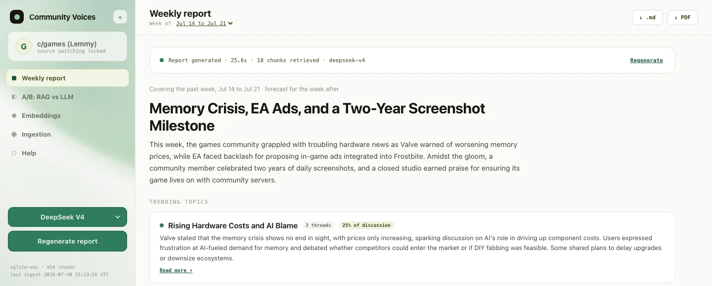

# Community Voices

A web app for turning community discussions into weekly digests with source citations.



*Reviewed overview of the July 14–21 public gaming report at [bryanzane.com/community-voices](https://bryanzane.com/community-voices/). A fixed screenshot, not a live feed.*

Regenerate: `cd docs/screenshots && npm ci && npx playwright install chromium && npm run capture`
(Node.js, network access, and `cwebp` required; captures the live site).

## Quick start

Two ways to run it:

**1. Hosted**: <https://bryanzane.com/community-voices/>. API keys are
configured server-side, so generation and A/B comparisons work with zero
setup. The hosted instance follows c/games; the live pull and source
switcher are admin-only there.

**2. Local install**: requirements are **Python 3.11+**. Node is *not*
required; the frontend ships pre-built.

```bash
git clone https://github.com/BryanZaneee/community-voices.git
cd community-voices/backend
python3 -m venv .venv && .venv/bin/pip install -r requirements.txt
.venv/bin/uvicorn app.main:app --port 8000
# open http://localhost:8000
```

The repo ships with a pre-ingested corpus (`data/community.sqlite`): a month
of c/games activity as 200 posts, 453 chunks with real voyage-3-large
embeddings, and 5 week windows, plus a few stored reports and comparisons
for browsing without API keys. **Generate report** runs the RAG pipeline
and saves a new report.

Generation uses provider API keys (DeepSeek: platform.deepseek.com, Voyage:
dashboard.voyageai.com). Copy `.env.example` to `.env` in the repo root and
fill in:

| Key | What it unlocks |
|---|---|
| `DEEPSEEK_API_KEY` | Generate weekly documents and run A/B comparisons (retrieval falls back to BM25 keyword search without a Voyage key) |
| `VOYAGE_API_KEY` | Full hybrid retrieval (BM25 + vector, RRF-fused), a fresh trailing-week pull before generating (at most every 12 hours), the "Run now" live pull, and switching ingest sources |
| `ANTHROPIC_API_KEY` (optional) | Adds Claude Opus 4.8 and Claude Sonnet 5 to the sidebar model picker alongside DeepSeek |

Without keys the app still boots: you can browse the embedding map, the
ingested corpus, and the ingestion funnel, and the full test suite runs.

## Using the app

- **Weekly report**: pick a week, click **Generate report**, and watch the
  eight-stage pipeline run live. Download the finished document as `.md` or
  print to PDF.
- **A/B (RAG vs LLM)**: side-by-side documents, scorecard, and verdict (see
  [the A/B test](docs/guide.md#the-ab-test)). **Generate report** runs the full comparison
  automatically; the A/B tab also has a standalone **Run A/B comparison**
  button (`POST /api/compare`).
- **Embeddings**: the 2-D map of every chunk. Toggle topic clusters vs
  retrieval heat, and click a cluster to inspect its most-retrieved chunks.
- **Ingestion**: the crawl funnel and latest-run numbers. **Run now** pulls
  the trailing 7 days of the current source live (needs a Voyage key;
  admin-only when `ADMIN_TOKEN` is set).
- **Help**: a plain-English FAQ of the moving parts.
- **Sidebar**: pick the generation model (DeepSeek V4 default; V4 Flash, and
  the Claude models with an Anthropic key) and switch the ingest source,
  which wipes the dataset and re-crawls the chosen community.

## Development

The served frontend is a pre-built SPA (`frontend/dist/`, committed on
purpose so running the app needs no Node). To edit it:

```bash
(cd backend && .venv/bin/uvicorn app.main:app --reload)   # API on :8000
(cd frontend && npm install && npm run dev)               # Vite dev server, proxies /api to :8000
(cd frontend && npm run build)                            # refresh frontend/dist before committing
```

## Tests

```bash
cd backend && .venv/bin/python -m pytest tests -q   # no API keys needed
```

Four layers, run in CI on every push:

- **Unit**: one file per module, fully offline (embeddings faked, LLM calls
  stubbed): chunker (splits, overlap, stable IDs), BM25 (ranking, distance
  transform), vector index (KNN, upserts, dim guards), embeddings, retriever
  (exact RRF math, mode switches, keyless degradation, week filtering), PCA,
  db helpers, ingest (markdown mapping, Lemmy field mapping, idempotency),
  llm (cost math, judge fallback chain), generation (facet retrieval,
  prompts, persistence).
- **API**: every endpoint through FastAPI's TestClient: happy paths, 400/404
  paths, download headers, stats accumulation, the SSE stream's event order,
  the SPA mount, plus the full flow end-to-end with every retrieval
  counted exactly once.
- **Real data**: integration tests over the committed store itself, real
  crawled posts and real voyage-3-large vectors, still keyless. Stored
  embeddings double as query vectors, so the suite proves KNN self-retrieval
  (each chunk's own vector finds it at distance ~0), vector-mode and
  week-filtered retrieval, and BM25 ranking against the actual corpus. One
  extra test embeds a live query through the Voyage API when
  `VOYAGE_API_KEY` is present (skipped in CI).
- **Regression**: pins bugs fixed during development (week-boundary
  alignment) plus a golden chunk-ID snapshot protecting the committed vector
  store.

## Documentation

- [What's inside](docs/guide.md#whats-inside)
- [Report Flow](docs/guide.md#report-flow)
- [The A/B test](docs/guide.md#the-ab-test)
- [The crawler](docs/guide.md#the-crawler)
- [Performance notes](docs/guide.md#performance-notes)

## Contributing

Branch naming, commit style, and the PR checklist live in
[CONTRIBUTING.md](CONTRIBUTING.md). Before opening a PR, run the suite above
from `backend/`. Never commit `.env` or a regenerated `data/community.sqlite`
unless the ingest change is the point of the PR.

## License

MIT. See [LICENSE](LICENSE).
